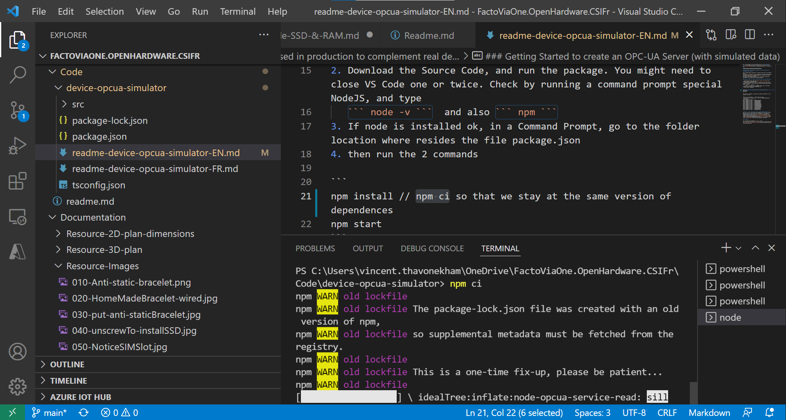
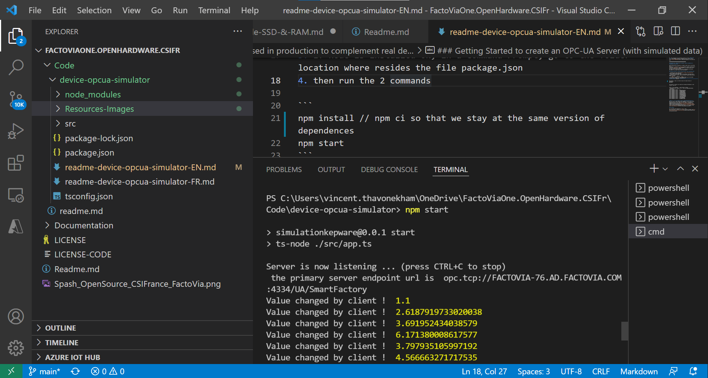

EN : This simulator of an IoT device relies on a true **PRODUCTION code** that manages the OPC UA  standard. We will use the  [Open Source project NodeOPCUA](https://node-opcua.github.io) from sterfive.com

#############################################

## FactoVia One - OPC-UA Device simulator (used in production to complement real devices)

The ** OPC-UA Device simulator** is based on data from an true OPC-UA Server.
This project is powered by [node-opcua](https://github.com/node-opcua/node-opcua "node-opcua"), where NodeOPCUA is an OPC UA stack fully written in TypeScript for NodeJS.
For simplicity, the OPC-UA server uses a self-signed certificate.
And Node.js is an open source server environment.

### Getting Started to create an OPC-UA Server (with simulated data)

1. Download and install Node.js [https://nodejs.org/en/download/](https://nodejs.org/en/download/)
2. *Note : VS code needs a restart to take into account the node install* 
3. Download the Source Code, and run the package. You might need to close VS Code one or twice. Check by running a command prompt special NodeJS, and type 
   ``` node -v ```  and also ``` npm ```
4. If node is installed ok, in a Command Prompt, go to the folder location where resides the file package.json
5. then run the 2 commands (takes about 5 to 10 minutes to get all the packages)

```
npm install // better : npm ci so that we stay at the same version of dependences
npm start
```


The project is started, you should see incoming informations in the console. Like this.

```
Server is now listening ... (press CTRL+C to stop)
 the primary server endpoint url is  opc.tcp://FACTOVIA-76:4334/UA/SmartFactory
Value changed by client !  1.1
Value changed by client !  0.608564388534536
Value changed by client !  1.356691161066117
Value changed by client !  5.18082014708217
Value changed by client !  6.203266104182854
Value changed by client !  8.683348743074347
Value changed by client !  3.9461922592302634
Value changed by client !  8.560708960781353
Value changed by client !  4.1213872390956325
Value changed by client !  2.6062222077107045
Value changed by client !  9.27313758010749
Value changed by client !  4.85616050355457
Value changed by client !  8.23009544175288
```

**That's it ! It's very easy to have a simulated OPC-UA device.**
The first line is your OPC-UA server endpoint. You can use a custom OPC-UA client for take a look to your OPC nodes, or any OPC-UA compatible product, such as [https://www.kepware.com](https://www.kepware.com/en-us/) (by PTC), [https://www.unified-automation.com](https://www.unified-automation.com/), [https://github.com/FreeOpcUa](https://github.com/FreeOpcUa) (Python and C++), or a popular one [http://www.openopcua.org](http://www.openopcua.org/) (C++).

### Go deeply

You can modify the simulation in `app.ts` file.
We let you enjoy to connect it to a Azure IoT Hub by example ! [https://docs.microsoft.com/en-us/azure/iot-hub/](https://docs.microsoft.com/en-us/azure/iot-hub/)



