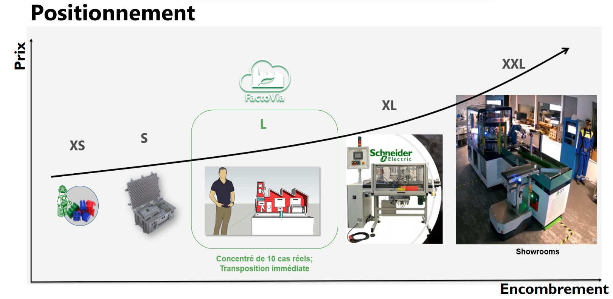
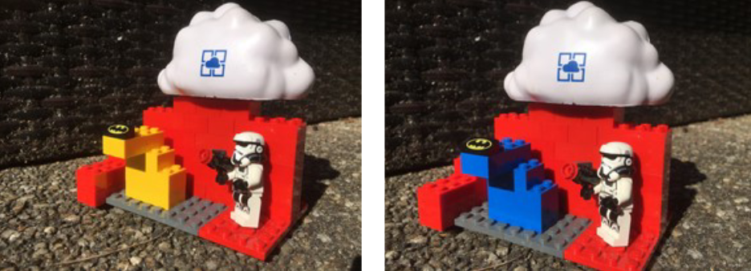
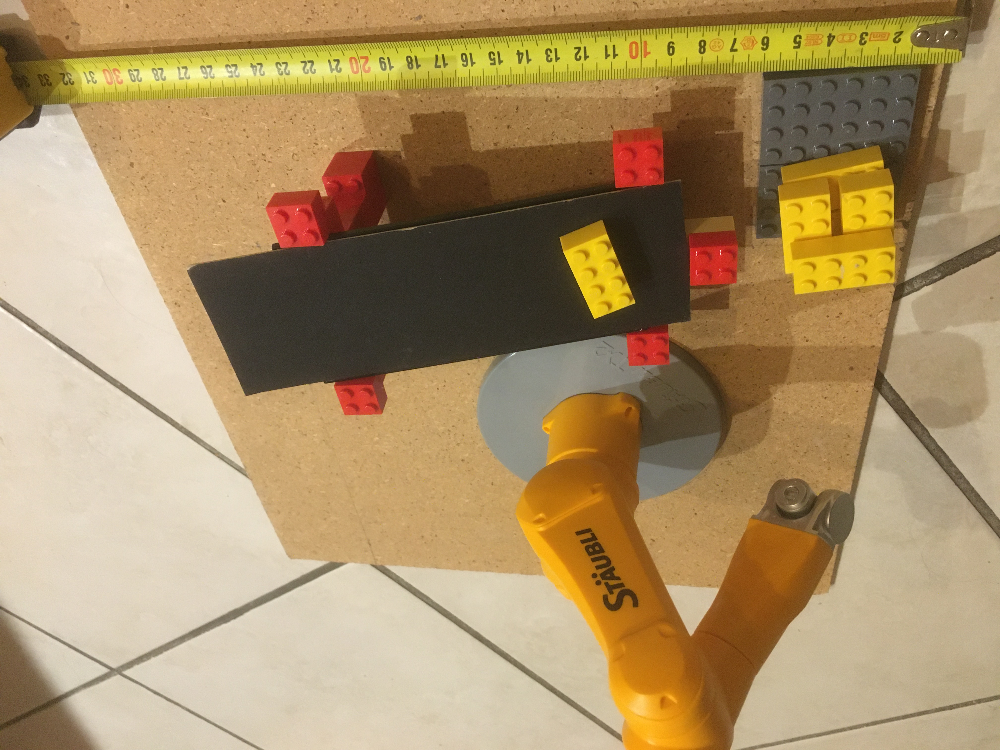
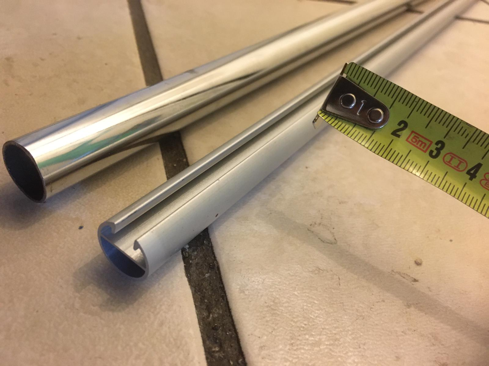
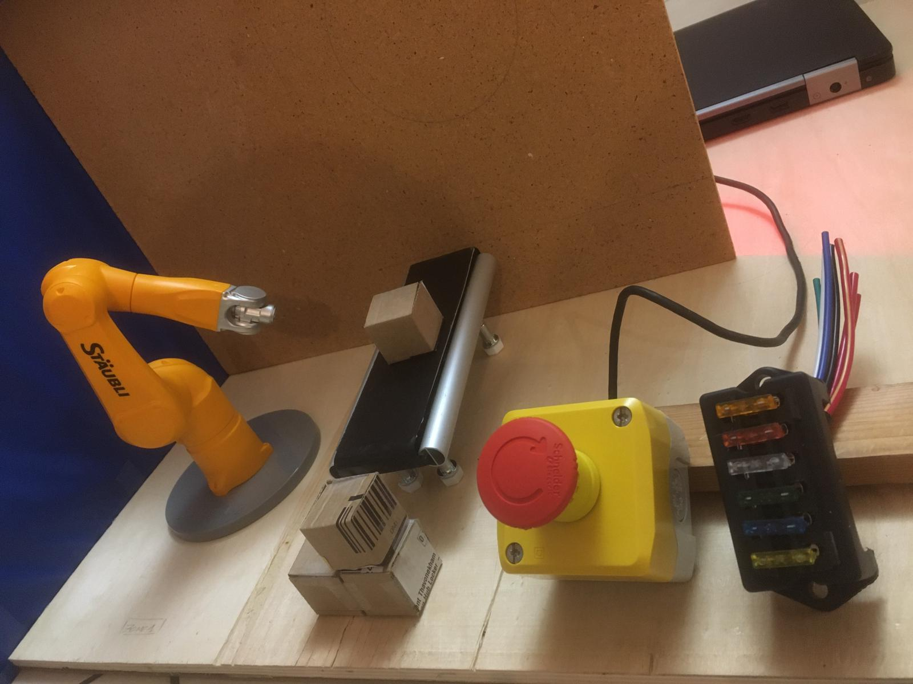
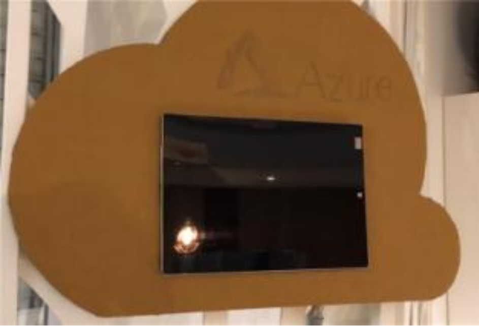

# Genesis of FactoVia One and 3 phases of manufactuting R&D : LEGO + Proto + Cardboard 

* Pre-requisites before manufacturinganything ! Market study and Product Market fit
  * 
  * Work with Montessori Reseacher-Teachers & Psychologues

# LEGO PHASE
* Design with Lego for the color choices and global positionning

* Testing the conveyor principles with Lego 
 

# MANUFACTUING PHASE
* Cardboard board phase
 

* Cardboard board phase
 

# CARDBOARDBOX PHASE
* Cardboard board phase
 
