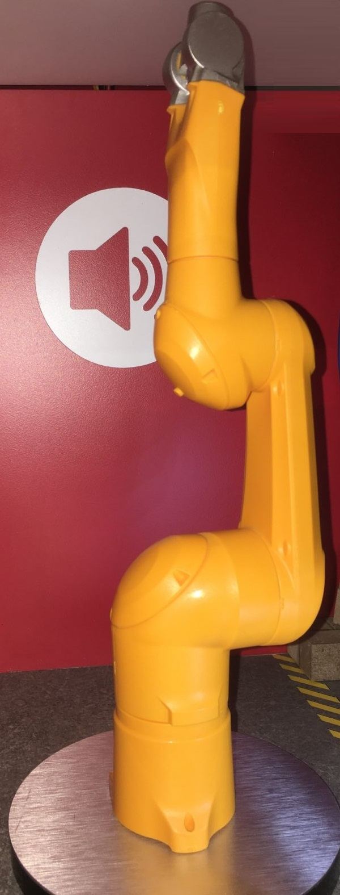
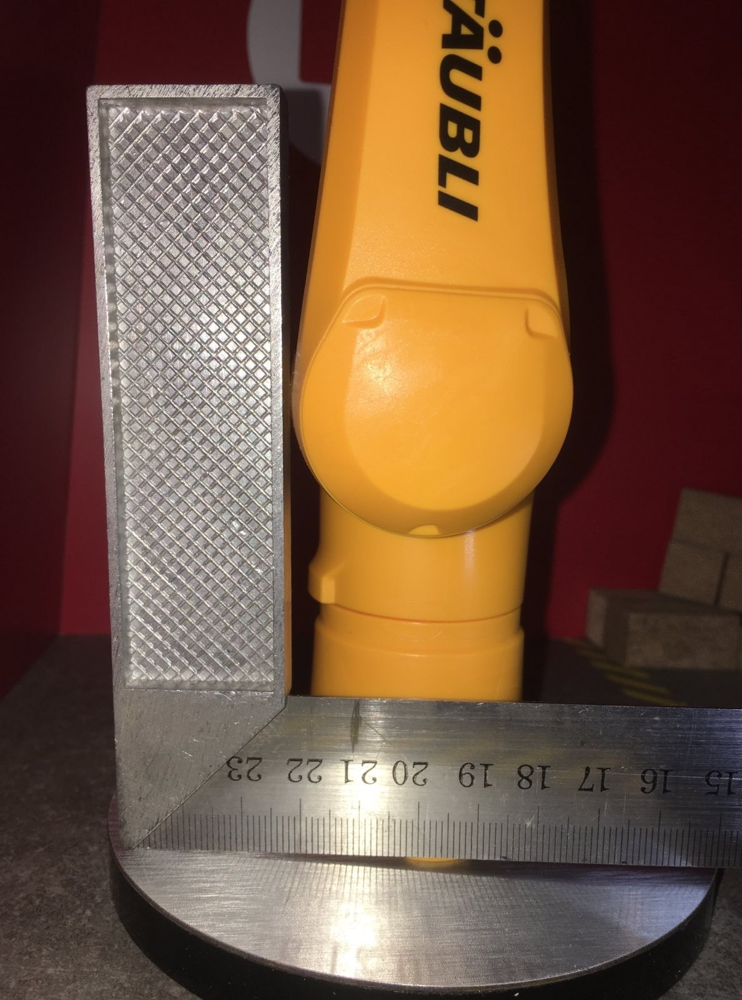
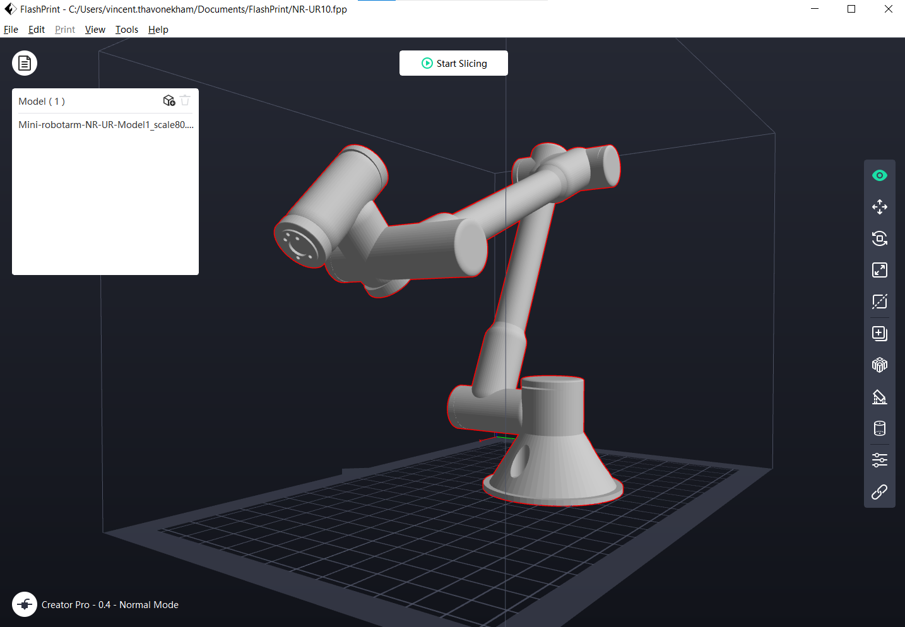
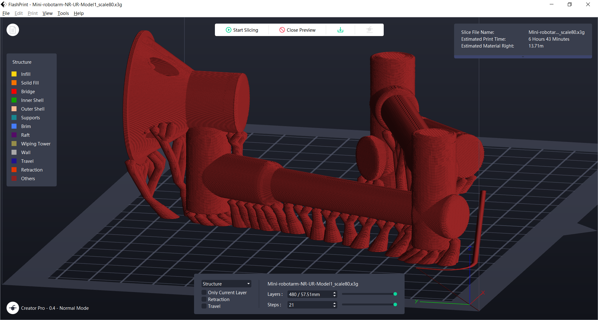
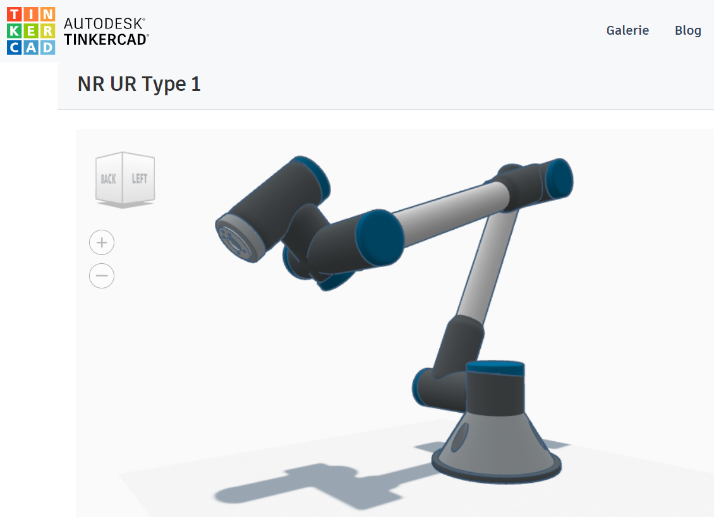

# Details of the mini-dummy robot arm

This robot arm came mostly from a gift from Stäubli, and then customized for its cirle metallic bases

* **Hight** (arm deployed) = 265 mm
  * 

* **Width** 
  * Width (metallic circle base) = 100 mm
  * Width (robot base) = 40 mm
  * 

* You could also print your own
  * use for example the exported TinkerCAD model into Mini-robotarm-NR-UR-Model1.obj and Mini-robotarm-NR-UR-Model1.stl (see folder ./Resource-3D-plan). Here with the printer Creator Pro with a base of 227 x 148 x 150.

The source of the original Creative Commons 3D source file (AUTODESK(R) TinkerCAD(R)) is : https://www.tinkercad.com/things/4TjY5777QWU  
