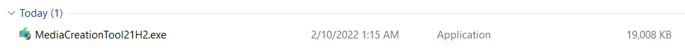
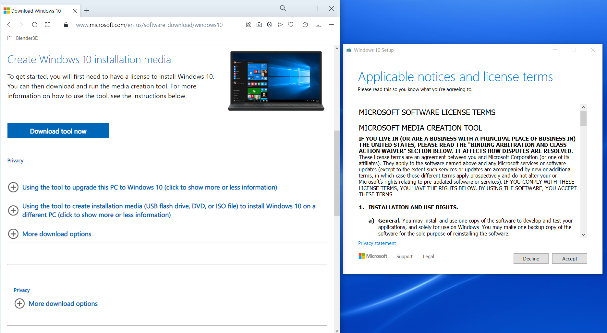
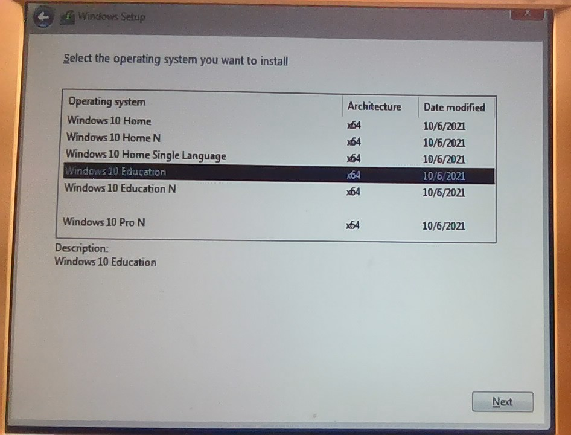
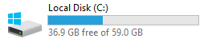
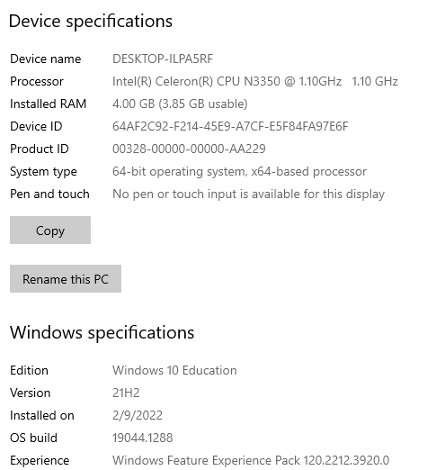
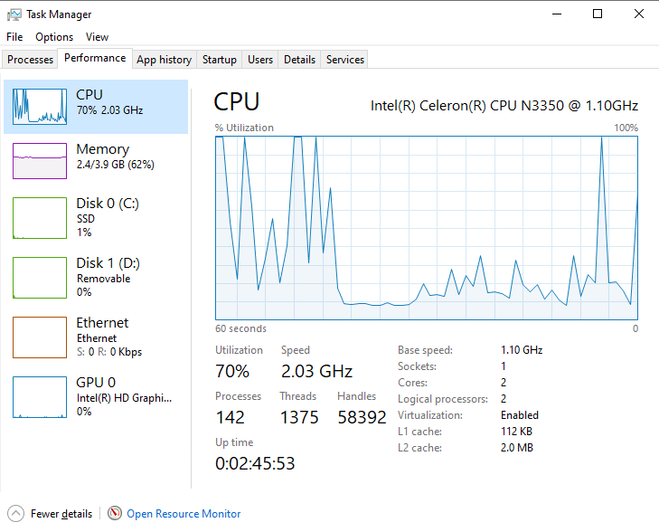

** OS not Open Sourced : Install Windows 10 & Configure ADVANTECH ARK-1124 **
For the demo purposes, you could use the user / password : 
* user : admfactoviaone
* password : demo-opensource-factovia-2022-industry

* Prepare USB Key > 5 GB
* Download special Microsoft tool **"MediaCreationTool21H2.exe"** to prepare the USB Key in 1 click (download latest version, and write simultaneously in the USB Key)

* and run the tool (see on the right)

* insert the USB Key and boot. It will start the basic mini-install
* when asked to enter the registration Key, choose "I don't have the registration key"
  Then it will lead you to a menu to choose which version of Win 10 to use. 
  Because it is a demo version for FactoVia One, choose "Windows 10 Education x64"

* prepare you license key (usually choose "Windows 10 for Education - MultipleActivation"
  for example : KBKGK-XXXXX-XXXXX-XXXXX-XXXXX
* accept the terms & conditions
* to choose a completely new install on the 59.6GB of free storage SSD, simply press "Next"
* the Install process will start (copying Windows files, getting files ready for installation, installing features, installing updates, finishing up)

* choose for the login "Joint domain" > user : see above > password : see above  > question 1 : "pet 1 name" = cat > "city born" = cat > "child nickname" = cat
* PRIVACY : No (location) > No (Find device) > "send required diag data" > No > No > Cortana = "Not now" ...

 **SANITY CHECK :**

