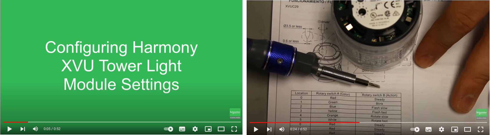
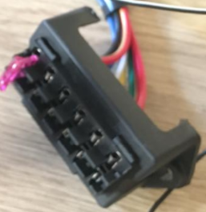
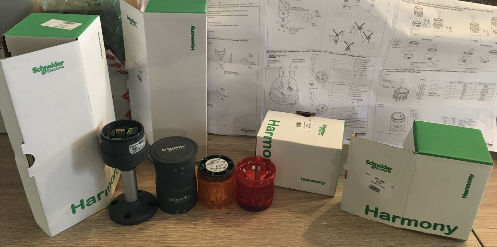
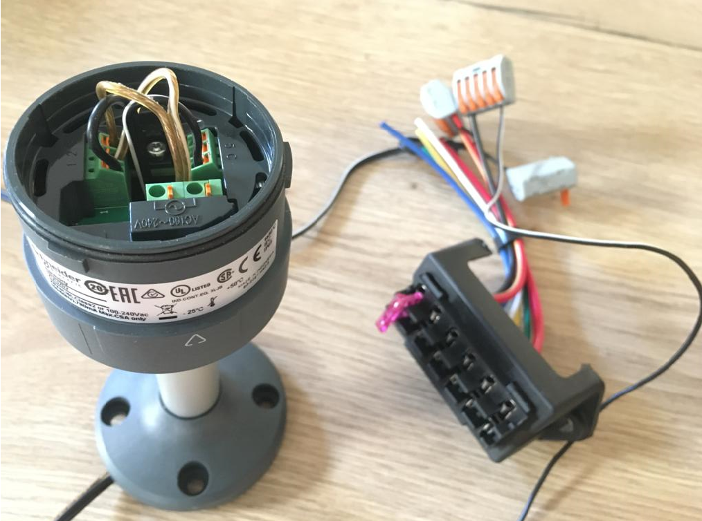
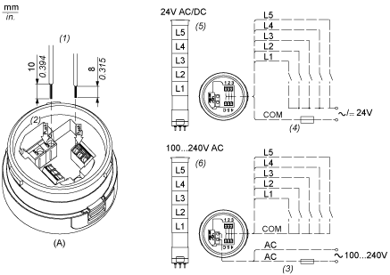
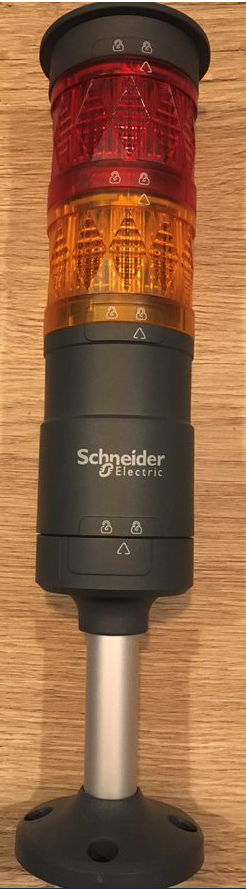
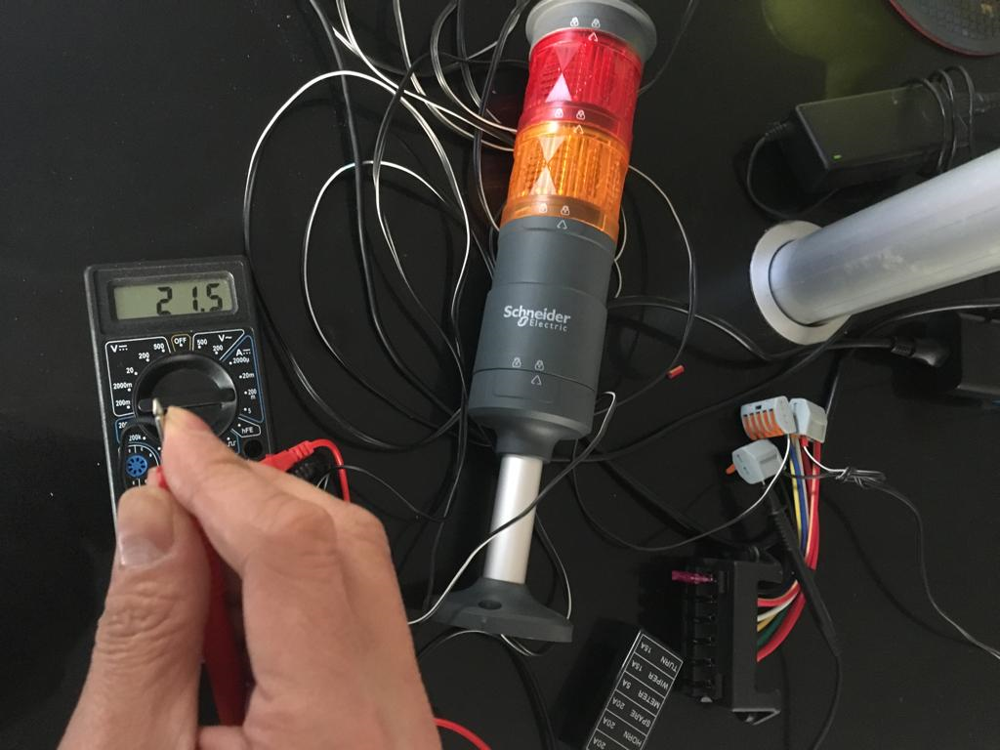
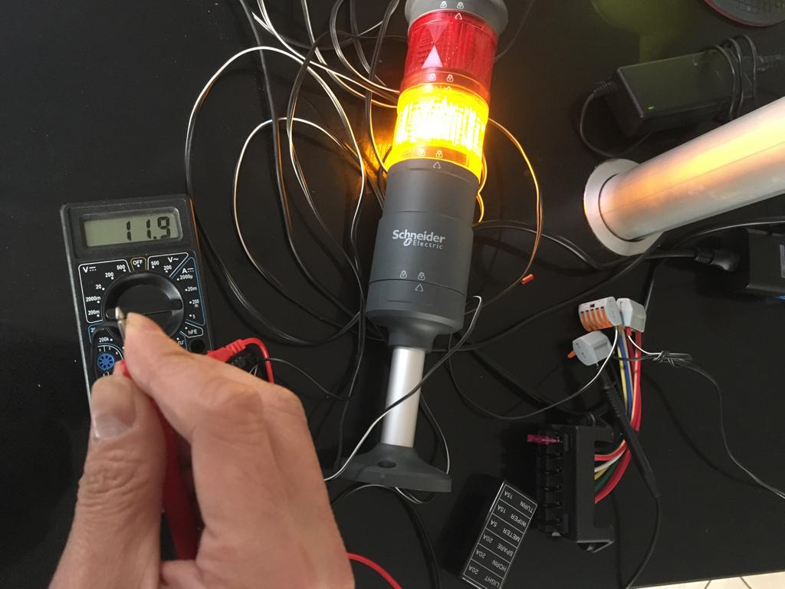

* We are going to use an equipment that is designed to be Green

* Before you start : 
  - look at this 50 sec video from Schneider Electric : https://www.youtube.com/watch?v=KaQS2MfXHi4
    
  - https://youtu.be/FKZX43fe-6s 
  - https://youtu.be/6PTkboC0bvQ 
  - get 1 to 6 wires (according to the modules you want to use). They should at least be 150 cm long
  - **/!\ NEEDS A FUSE !!!  Capacity 0.5 A, 125 V**
  - get a fuse support : 

   or for our tests : 

* unpack the puzzle !

* Perform the wiring according to the documentation ; **DON'T FORGET to add a FUSE that is not provided**.

* Assemble all the modules according to this detailed image (security lock on the base, via a small screw, has to be removed or untightened first. See video in the link below). It will look like this : 
more info in video : https://youtu.be/ZfthcWQhHGk

SANITY CHECK : 
* When blinking versus no blinking, we have the current intensity consumption of 21.5 mA versus 12 mA (the images below could lead to error, because we have a lag between the multi-meter that mesures the data and displays it, the actual blink and the remanescence effect of the light, and the time the camara takes a picture !)
* 
* 
