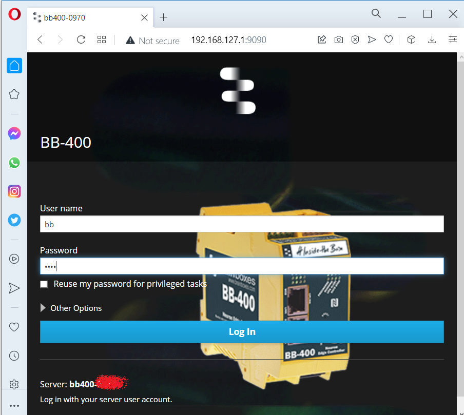
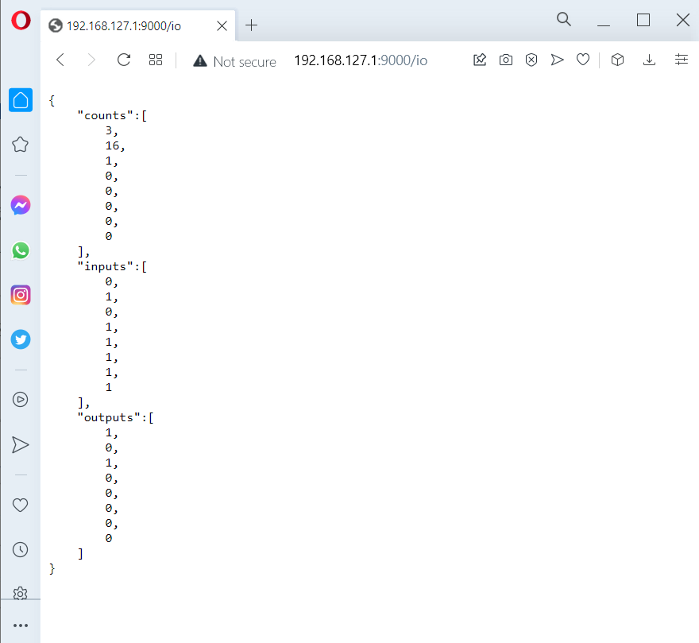

# How to mount power, Install and Configure a BB-400

**FIRST SECTION** : Properties of this documentation
* **Difficulty** : 3/5 
  * Detail the difficulty for a non-expert person (not the expert that could do that in 5 minutes) 

* **Estimated time to perform** : 1 hour
  * Gives an estimated time to complete the opetations for a non-expert person (not the expert that could do that in 5 minutes)

**SECOND SECTION**
* Bill of material

https://www.brainboxes.com/news/introducing-the-bb-400-neuron-edge-controller

**POWER**
The recommanded Power Supply is this one (PW-400 : OUTPUT: 12V DC 1.5A) : 
https://www.brainboxes.com/product/accessories/power-supplies/pw-400

However, depending on the Use Case that we want to implement in FactoVia One, we will be needing either 29V DC, 25V DC, 19V DC, 12V DC ou 5V DC.
In this example, we are going to use a 19V DC 3.16A which could be dangerous for the BB-400, that can cope with 15 W Maximum. Else you could grill your BB-400, if we don't take care of what we are plugging on the BB-400 as output devices. 

**Properties** Power Input : +5V to +30V DC 15W Max

Depending on the hardware configuration that you install on the FactoVia One, the calculations below will be different.
In our case, we rely on a 24V DC (eg TowerLights, fans, ...) we have : 
15W / 24V = 0.625 ampers = 625 mA as a MAXIMUM ALLOWED consumption of current (Ampers) for the BB-400.

We mesured previously that the TowerLights (Green/Orange/Red) uses about 21.5 mA. Let's round it up we a security factor to 30 mA per light. But we will not use all the light at the same time.

IMPORTANT : calculation of maximum Ampers and Watts that flow inside the BB-400.
The Max allowed 625 mA (see previous calculation)

We have than Ampers usage for BB-400 + TowerLights + horn + fan ... that should be less than 150 mA, i.e. that are in total far less than 625 mA. As a result, we are secured !

# INSTALL
# NETWORK CONFIGURATION
Below, we are going to use the NETGEAR Switch : 
- prerequisite : Plug in the RJ45 of ARK1124 to NETGEAR Switch (for instance entry "1")
- Plug in the RJ45 of BB-400 (the entry "LAN") to NETGEAR Switch (for instance entry "2")

Notes : 
1) Alternative to For debug purpose, you could directly plug-in a RJ45 ethernet cable between the BB-400 (LAN and not UPLINK for this debug configuration) and ARK-1124 (either female front plug or rear).
2) You could also use wifi access

**SANITY CHECK**
* Test the output (for example green pins 1 and 3) using a Multimeter : when plugging a LED on an output, we have 4.5V, 20 mA
* go to the BB-400 management portal at the URL : https://bb400-XXXX:9090 (where XXXX is the last 4 digit of your MAC address)
* Query the BB-400 REST API at the URL (not https): http://bb400-XXXX:9000/io 
it should return the status of the LED in front of the BB-400
* From the ARK-1124 :  
  *  ping bb400-XXXX
     *  should return a time<1ms and an IPv6 address
  *  ping bb400-XXXX -4  // to force returning the IP in v4
     *  should return a time<1ms and an IPv4 address
     *  IPv4 = 192.168.127.1
*  Now we know its IPv4 address, we could test the web portal https://192.168.127.1:9090/io
     *    
*  and the REST API using its URL : http://192.168.127.1:9000/io
   *  

